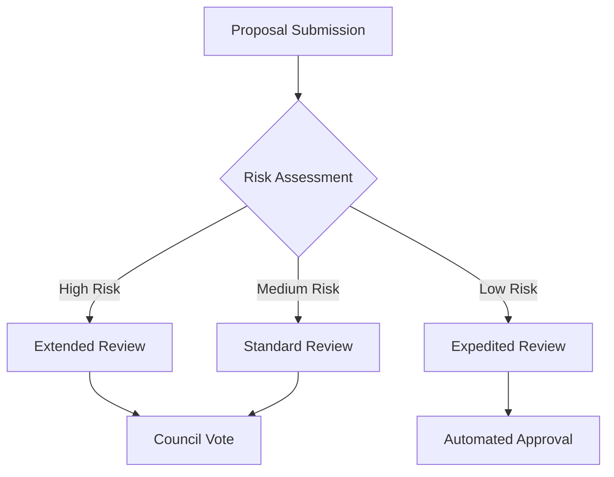

# Cosmic Microstructure Manipulation Network (CMMN)

## System Architecture Overview

A decentralized platform for theoretical exploration and careful manipulation of spacetime microstructure through quantum mechanical approaches.

### Core Components

#### 1. Quantum Gravity Interface
```
├── Planck Scale Detectors
│   ├── Quantum Fluctuation Sensors
│   ├── Spacetime Curvature Monitors
│   └── Vacuum Energy Analyzers
└── Manipulation Systems
    ├── Quantum Field Modulators
    ├── Metric Tensor Adjusters
    └── Topological State Controllers
```

#### 2. Smart Contract Framework
```solidity
contract MicrostructureExperiment {
    struct Experiment {
        uint256 experimentId;
        bytes32 configHash;
        uint8 riskLevel;
        address proposer;
        string[] safetyProtocols;
        bool approved;
    }
    
    struct ManipulationProtocol {
        uint256 protocolId;
        address implementer;
        uint256 energyRequirement;
        uint8 spatialScope;
        bool active;
    }
    
    mapping(uint256 => Experiment) public experiments;
    mapping(uint256 => ManipulationProtocol) public protocols;
}
```

### Safety Mechanisms

#### 1. Containment Protocols
- Planck-scale isolation barriers
- Quantum state preservation systems
- Locality principle enforcement
- Causality protection measures

#### 2. Monitoring Systems
```
Stability Metrics = Base Reality * (1 / Perturbation Magnitude) * Safety Factor
Risk Assessment = ∑(Manipulation Impact * Timeline Effects) / Containment Level
```

### Technical Implementation

#### Quantum Gravity Integration
1. Detection Systems
    - Quantum foam fluctuation measurement
    - Microscopic black hole monitoring
    - String vibration analysis

2. Manipulation Tools
    - Vacuum energy modulators
    - Metric tensor adjusters
    - Topological state controllers

#### Simulation Framework
```
├── Core Engine
│   ├── Quantum Gravity Solver
│   ├── Field Theory Calculator
│   └── Topology Analyzer
├── Safety Systems
│   ├── Stability Monitor
│   └── Cascade Prevention
└── Visualization
    ├── Microstructure Mapper
    └── Effect Projector
```

### Governance Structure

#### Experiment Approval Process
1. Proposal Phase
    - Technical documentation
    - Risk assessment
    - Containment plan

2. Review Phase
    - Peer validation
    - Safety audit
    - Resource evaluation

#### Voting System


### Token Economics

#### Utility Functions
- CMMN governance token
- Experiment proposal staking
- Safety protocol validation

#### Incentive Structure
```
Reward = Base Token * (Innovation Factor + Safety Metric)
Stake Required = Base Stake * (Risk Level * Impact Scope)
```

### Safety Protocols

#### 1. Physical Safeguards
- Reality anchor points
- Quantum state preservers
- Causal loop preventers

#### 2. Technical Measures
- Multi-signature authorization
- Quantum encryption
- Automated shutdown triggers

### Future Development

#### Phase 1: Foundation
- Basic detection systems
- Initial safety protocols
- Governance framework

#### Phase 2: Enhancement
- Advanced manipulation tools
- Expanded simulation capabilities
- Enhanced safety measures

#### Phase 3: Advanced Research
- Full quantum gravity integration
- Universal manipulation capabilities
- Complete safety automation

## Technical Considerations

### Performance Metrics
1. Detection Precision
    - Planck length resolution
    - Quantum state fidelity
    - Temporal accuracy

2. Safety Parameters
    - Reality stability index
    - Causality preservation metric
    - Quantum coherence level

### Risk Management

#### 1. Containment Levels
- Local space-time isolation
- Quantum state preservation
- Cascade effect prevention

#### 2. Emergency Procedures
- Automatic experiment termination
- Reality anchor reinforcement
- Quantum state restoration

## Conclusion

The Cosmic Microstructure Manipulation Network represents a careful approach to exploring and potentially manipulating the fabric of spacetime while maintaining strict safety protocols and ethical guidelines.
